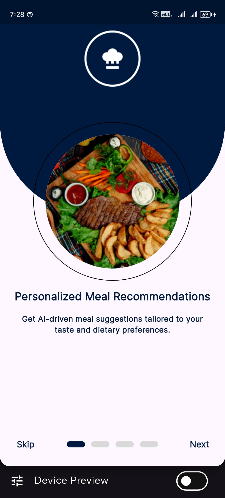
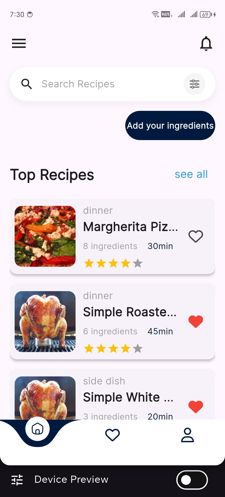
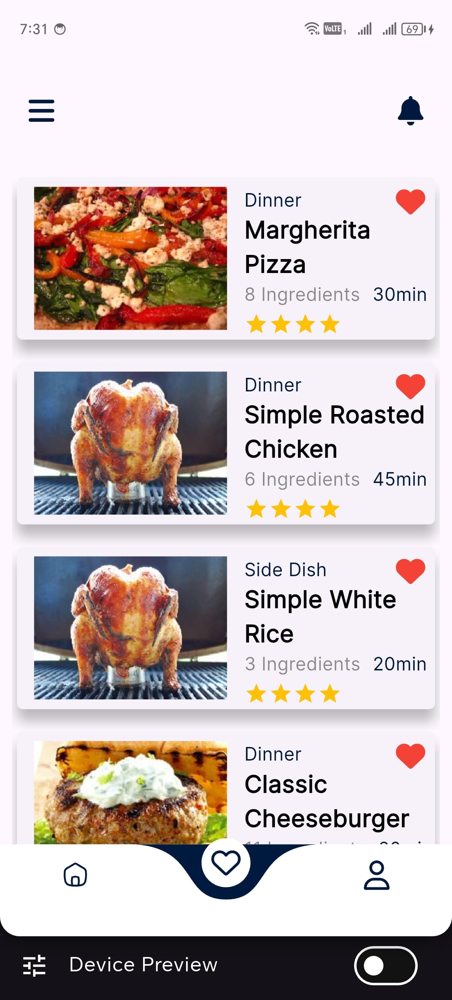
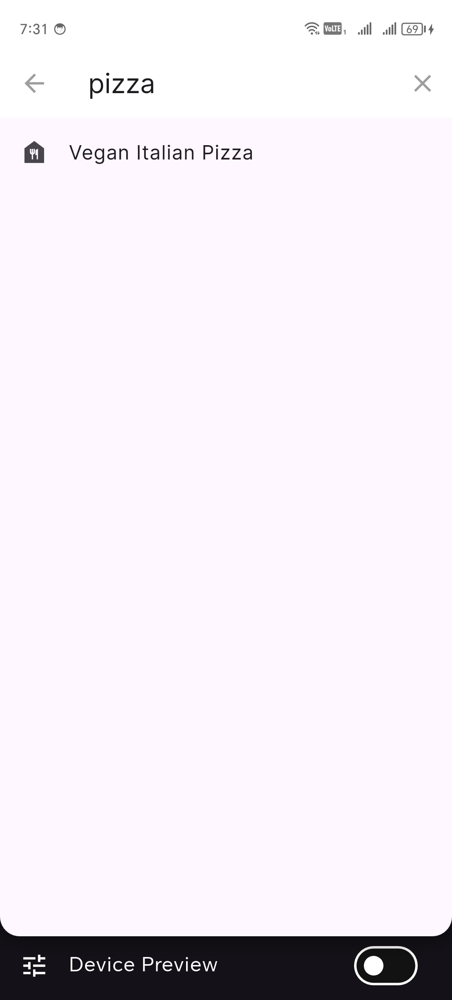
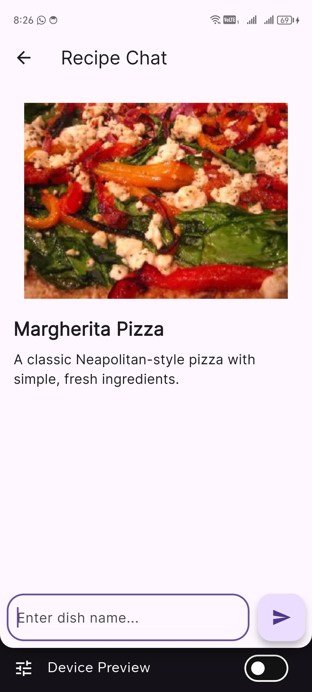
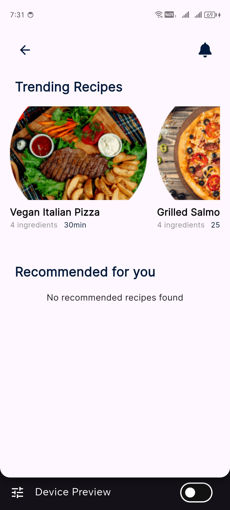

# Meal Recommendation App - Flutter Food Application 🍽️✨


## 🍳 App Showcase

### 🎮 Video Demonstration
[🎥 Watch App Demo](https://drive.google.com/file/d/1ONE33U3qL3hTvgylfdnwcXiG7Vq7gQ2_/view?usp=sharing)

### 📱 Screenshots
<p align="center">
  
  
  
  
  
  
  
  
  
  
 
</p>

## 🚀 Project Overview

Meal Recommendation is a Flutter-based application that helps users discover, save, and get AI-powered meal suggestions. It integrates with **Firebase** for authentication/data storage and **Google Gemini API** for AI recommendations.

### 🔑 Key Highlights
- 🔐 **Authentication**: Email/Password, Google, and Facebook login
- 🍕 **Recipe Database**: Browse trending/recommended meals
- ❤️ **Favorites System**: Save favorite recipes
- 🤖 **AI-Powered Recommendations**: Gemini-generated meal suggestions
- 📱 **Modern UI**: Clean, responsive interface with animations
- 🔥 **Firebase Integration**: Real-time data sync
- 🧩 **Modular Architecture**: Clean Architecture with BLoC pattern

## 🛋️ Technical Specifications

| Aspect | Details |
|--------|---------|
| **Framework** | Flutter |
| **State Management** | BLoC |
| **Architecture** | Clean Architecture |
| **Backend** | Firebase (Auth, Firestore, Storage) |
| **AI Service** | Google Gemini API |
| **Dependency Injection** | GetIt |
| **Routing** | GoRouter |
| **UI Toolkit** | Material 3 with custom themes |

## ✨ Features

- **User Authentication**
  - Email/password login
  - Google Sign-In
  - Facebook Login

- **Recipe Management**
  - Browse trending/recommended recipes
  - Detailed recipe view (ingredients, nutrition, steps)
  - Favorite recipes system

- **AI Integration**
  - Generate recipes from ingredients
  - Get nutritional analysis

- **User Profile**
  - View/edit profile
  - Manage saved recipes

## 🛠️ Getting Started

### Prerequisites
- Flutter SDK 3.7+
- Firebase project setup
- Google Gemini API key

### Installation
1. Clone the repository
```bash
git clone https://github.com/MuhammedZain15/meal_recommendation.git
```

2. Configure Firebase:
- Add your `google-services.json` (Android) and `GoogleService-Info.plist` (iOS)
- Set up Firebase Auth, Firestore, and Storage

3. Add Gemini API key:
```dart
// lib/core/utils/constants.dart
const String GEMINI_API_KEY = "your_api_key";
```

4. Install dependencies
```bash
flutter pub get
```

5. Run the app
```bash
flutter run
```

## 🤝 Technology Stack & Dependencies
- **Core**: Flutter, Dart
- **State Management**: BLoC, Cubit
- **Firebase**: Auth, Firestore, Storage
- **AI**: google_generative_ai
- **UI**: Lottie, CachedNetworkImage, Google Fonts
- **Navigation**: GoRouter
- **DI**: GetIt
- **Utilities**: Equatable, Dartz, ScreenUtil

## 🏗️ Project Structure

```
lib/
├── core/               # Framework-agnostic components
│   ├── components/     # Reusable widgets
│   ├── services/       # Service layer
│   ├── utils/          # Constants, styles
│   └── error/          # Error handling
│
├── features/           # Feature modules
│   ├── auth/           # Authentication flow
│   ├── home/           # Main recipe browser
│   ├── favorite/       # Saved recipes
│   ├── profile/        # User profile
│   └── gemini/         # AI integration
│
└── main.dart           # App entry point
```

## 🔥 Key Implementation Details

1. **Firebase Integration**:
   - Multi-platform configuration (Android/iOS/Web)
   - App Check for security
   - Firestore data modeling for recipes

2. **AI Recipe Generation**:
   - Gemini API for recipe suggestions
   - Structured prompt engineering for consistent responses
   - Fallback to Spoonacular API for recipe images

3. **State Management**:
   - BLoC for complex state
   - Cubit for simpler state
   - Repository pattern for data abstraction

4. **Performance Optimizations**:
   - Firestore pagination
   - CachedNetworkImage for images
   - Efficient rebuilds with Equatable

## 🤝 About the Developers

This project was developed by **Ahmed Maher** , **Mohamed Zain** , **Abdallah Gadallah** , **Omar Elshahawy** , **Ziad Mohamed** , **Mohamed Ahmed** , showcasing expertise in:
- Flutter app architecture
- Firebase integration
- AI API integration
- State management solutions
- Clean code practices

## 🎨 Design Inspiration
- Custom UI/UX with focus on food imagery
- Material 3 theming with custom colors
- Animated transitions between screens

## 💪 Acknowledgments
- Flutter Team
- Firebase Team
- Google Gemini API
- Spoonacular API
- Open-source community contributors

## 🙏 Contributing
Contributions welcome! Please open issues for bug reports or feature requests.

---
